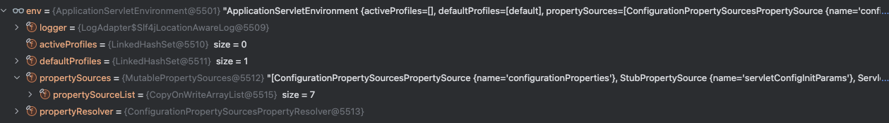

1. 将client配置去除springboot依赖，改成spring-context
```xml
<?xml version="1.0" encoding="UTF-8"?>
<project xmlns="http://maven.apache.org/POM/4.0.0" xmlns:xsi="http://www.w3.org/2001/XMLSchema-instance"
         xsi:schemaLocation="http://maven.apache.org/POM/4.0.0 https://maven.apache.org/xsd/maven-4.0.0.xsd">
    <modelVersion>4.0.0</modelVersion>
    
    <groupId>com.so</groupId>
    <artifactId>soconfig-client</artifactId>
    <version>0.0.1-SNAPSHOT</version>
    <name>soconfig-client</name>
    <description>soconfig-client</description>
    <properties>
        <java.version>17</java.version>
        <maven.compiler.source>17</maven.compiler.source>
        <maven.compiler.target>17</maven.compiler.target>
        <project.build.sourceEncoding>UTF-8</project.build.sourceEncoding>
        <project.reporting.outputEncoding>UTF-8</project.reporting.outputEncoding>
    </properties>
    <dependencies>
        <dependency>
            <groupId>org.projectlombok</groupId>
            <artifactId>lombok</artifactId>
            <version>1.18.22</version>
            <optional>true</optional>
        </dependency>
        <dependency>
            <groupId>org.springframework</groupId>
            <artifactId>spring-context</artifactId>
            <version>6.1.6</version>
        </dependency>
        <dependency>
            <groupId>com.alibaba</groupId>
            <artifactId>fastjson</artifactId>
            <version>1.2.83</version>
        </dependency>
        <dependency>
            <groupId>org.springframework.cloud</groupId>
            <artifactId>spring-cloud-context</artifactId>
            <version>4.1.0</version>
        </dependency>
    </dependencies>

</project>
```
> 注意：spring-context与springboot的版本一致性

2. 创建注解 EnableSoConfig 用于实现自动化配置，用于SpringApplication启动类上，用于表示启用SoConfig
```java
@Documented
@Retention(RetentionPolicy.RUNTIME)
@Target(ElementType.TYPE)
@Inherited
//@Import({SoConfigRegistrar.class})
public @interface EnableSoConfig {
}
```
3. 创建soconfig-demo, 新建SoDemoConfig,作为一个Bean的配置类
```java
@Data
@ConfigurationProperties(prefix = "so")
public class SoDemoConfig {
    String a;
    String b;
}
```
4. 在SoConfigDemoApplication中注入SoDemoConfig，添加k.a的value注解属性，开启配置中心@EnableSoConfig
5. 在soconfig-demo的application中配置k.a属性
```java
@SpringBootApplication
@EnableConfigurationProperties({SoDemoConfig.class})
@RestController
public class SoconfigDemoApplication {

    public static void main(String[] args) {
//        SpringApplication.run(SoconfigDemoApplication.class, args);
        ConfigurableApplicationContext applicationContext = SpringApplication.run(SoconfigDemoApplication.class, args);
        System.out.println(" &&&& ====> " + applicationContext.getBean(ConfigurationPropertiesRebinder.class));
    }

    @Autowired
    Environment env;

    @Autowired
    SoDemoConfig soDemoConfig;

    @Value("${so.a}")
    private String a;

    @Value("${so.b}")
    private String b;


    @Bean
    ApplicationRunner  applicationRunner() {
        System.out.println(Arrays.toString(env.getActiveProfiles()));
        return args -> {
            System.out.println("hello world");
            System.out.println(a);
            System.out.println(soDemoConfig.getA());
        };
    }

}
```

6. 定义一个接口SoConfigService, 定义2个方法，getPropertyNames(), getProperty(name)
```java
public interface SoConfigService {
    
    String[] getPropertyNames();
    
    String getProperty(String name);
}
```

7. 回到soconfig-client中，新建一个SoPropertySource 继承 EnumerablePropertySource<SoConfigService>, SoPropertySource用于代理SoConfigService提供的能力
```java
public class SoPropertySource extends EnumerablePropertySource<SoConfigService> {
    
    public SoPropertySource(String name, SoConfigService source) {
        super(name, source);
    }
    
    @Override
    public String[] getPropertyNames() {
        return source.getPropertyNames();
    }

    @Override
    public Object getProperty(String name) {
        return source.getProperty(name);
    }
}
```
8. 写一个SoConfigService的实现类，SoconfigServiceImpl，用于对config实现真正的操作，主要实现方式是：通过从soconfig-server获取数据，加载到一个map中来。

```java
@Slf4j
public class SoConfigServiceImpl implements SoConfigService {
    
    Map<String, String> config;
    ApplicationContext applicationContext;
    
    public SoConfigServiceImpl(ApplicationContext applicationContext, Map<String, String> config) {
        this.applicationContext = applicationContext;
        this.config = config;
    }
    @Override
    public String[] getPropertyNames() {
        return this.config.keySet().toArray(new String[0]);
    }

    @Override
    public String getProperty(String name) {
        return this.config.get(name);
    }
}
```

> 注：propertyResolver


9. 将属性塞入Spring的环境上下文中，定义一个PropertySourcesProcessor, 它需要继承 BeanFactoryPostProcessor, PriorityOrdered.
```java

9.1. 定义一个SoPropertySources的属性来源字段集合，假设已经从自定义配置数据源获取到了属性map，需要在这里将这个SoPropertySource塞到Environment中 

9.2. 定义一个SoPropertySource的属性来源字段，类型为CompositePropertySource，将上面的SoPropertySources，塞到SoPropertySource，然后再塞到environment中
@Data
public class SoPropertySourcesProcessor implements BeanFactoryPostProcessor, ApplicationContextAware, EnvironmentAware,
        PriorityOrdered {
    
    public static final String CUSTOM_PROPERTY_SOURCES = "SoPropertySources";
    public static final String CUSTOM_OUTER_PROPERTY_SOURCE = "SoPropertySource";
    
    Environment environment;
    ApplicationContext applicationContext;
    
    
    @Override
    public void postProcessBeanFactory(ConfigurableListableBeanFactory beanFactory) throws BeansException {
        ConfigurableEnvironment env = (ConfigurableEnvironment) environment;
        if (env.getPropertySources().contains(CUSTOM_OUTER_PROPERTY_SOURCE)) {
            return;
        }
        
        Map<String, String> configMeta = new HashMap<>();
        
        SoConfigService configService = new SoConfigServiceImpl(applicationContext, configMeta);
        
        SoPropertySource soPropertySource  = new SoPropertySource(CUSTOM_OUTER_PROPERTY_SOURCE, configService);
        CompositePropertySource composite = new CompositePropertySource(CUSTOM_OUTER_PROPERTY_SOURCE);
        composite.addPropertySource(soPropertySource);
        env.getPropertySources().addFirst(composite);
    }
    

    @Override
    public int getOrder() {
        return PriorityOrdered.HIGHEST_PRECEDENCE;
    }
}
```

10. 实现自动配置，SoConfigRegistrar, 实现注册bean，将PropertySourcesProcessor当作bean注入进来。为了防止重复注册，前面需要查重。

```java
public class SoConfigRegistrar implements ImportBeanDefinitionRegistrar {

    @Override
    public void registerBeanDefinitions(AnnotationMetadata importingClassMetadata, BeanDefinitionRegistry registry) {
        registerClass(registry, SoPropertySourcesProcessor.class);
    }

    private void registerClass(BeanDefinitionRegistry registry, Class<?> clazz) {
        System.out.println(clazz.getName());
        Optional<String> first = Arrays.stream(registry.getBeanDefinitionNames())
                .filter(x -> clazz.getName().equals(x)).findFirst();
        
        if (first.isPresent()) {
            System.out.println("SoPropertySourcesProcessor already registered");
            return;
        }

        AbstractBeanDefinition beanDefinition = BeanDefinitionBuilder.genericBeanDefinition(clazz).getBeanDefinition();
        registry.registerBeanDefinition(clazz.getName(), beanDefinition);
    }
}
```

11. soconfig-demo引入 soconfig-client, 启动soconfig-demo, 观察控制台输出，可以发现，soconfig-client已经将SoPropertySourcesProcessor注册进来了。

